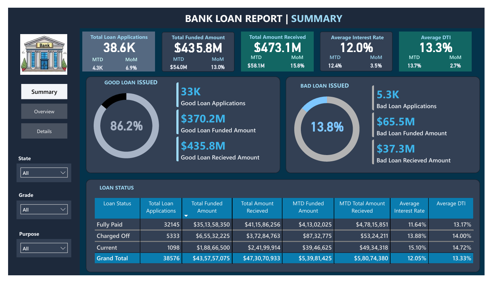
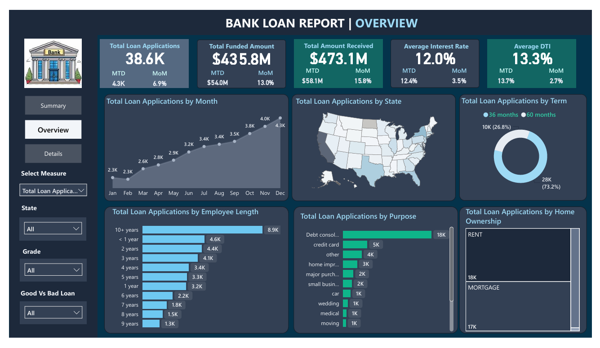

# 🏦 Bank Loan Analysis Using SQL Server and Power BI


> An end-to-end data analytics project that transforms 38,576 raw loan records into an interactive, decision-ready Power BI dashboard — covering lending volume, repayment performance, loan quality, and borrower risk profiling.

---

## 📌 Project Overview

This project analyzes the performance of a bank's loan portfolio using **SQL Server** for data extraction and KPI calculation, and **Power BI** for interactive visualization and reporting. It simulates a real-world business intelligence workflow: a bank's leadership team needs a single source of truth to monitor lending activity, track repayment health, and identify risk concentrations across borrower segments.

The final deliverable is a **3-page interactive Power BI dashboard** (Summary, Overview, Details) backed by SQL-validated KPIs, designed to support data-driven decisions in loan issuance, credit risk management, and portfolio strategy.

**Dataset size:** 38,576 loan records × 24 attributes
**Reporting period:** January 2021 – December 2021

---

## ❓ Business Problem

Bank management lacked a consolidated, visual way to answer core lending questions:

- How large is our current loan portfolio, and how fast is it growing month over month?
- What proportion of loans are performing well ("Good Loans") versus defaulting ("Bad Loans")?
- Which borrower segments (state, employment length, home ownership, loan purpose) contribute the most volume and risk?
- Are we recovering more than we're lending out, or is the portfolio under-collecting?
- Where should credit policy and marketing focus be adjusted to reduce risk and grow responsibly?

Without a structured reporting layer, these questions required manual, error-prone spreadsheet analysis. This project solves that by building a governed SQL-to-BI pipeline that answers them at a glance.

---

## 🎯 Project Objectives

1. Clean, validate, and structure raw loan-level data for reliable analysis.
2. Write SQL queries to calculate core lending KPIs (applications, funded amount, amount received, interest rate, DTI).
3. Classify loans into **Good Loan** vs **Bad Loan** categories to quantify portfolio health.
4. Build a multi-page Power BI dashboard with MTD/MoM tracking, trend analysis, and drill-through detail.
5. Segment loan performance by geography, purpose, employment length, home ownership, and loan term.
6. Translate findings into actionable business recommendations for credit risk and portfolio management.

---

## 🗂️ Dataset Description

The dataset (`financial_loan.csv`) contains **38,576 individual loan records** with the following key fields:

| Category | Fields |
|---|---|
| **Identifiers** | `id`, `member_id` |
| **Loan Details** | `loan_amount`, `int_rate`, `installment`, `term`, `grade`, `sub_grade`, `purpose`, `application_type` |
| **Dates** | `issue_date`, `last_payment_date`, `next_payment_date`, `last_credit_pull_date` |
| **Borrower Profile** | `address_state`, `emp_title`, `emp_length`, `home_ownership`, `annual_income`, `verification_status`, `dti` |
| **Repayment Status** | `loan_status`, `total_payment`, `total_acc` |

**Loan Status Categories:** `Fully Paid`, `Current`, `Charged Off`

---

## 🛠️ Technology Stack

| Tool | Purpose |
|---|---|
| **SQL Server / SSMS** | Data querying, KPI calculation, aggregation logic, validation |
| **Power BI Desktop** | Dashboard design, data modeling, DAX measures, interactive visuals |
| **Power Query** | Data cleaning, transformation, and load (ETL) |
| **DAX** | Custom measures for KPIs, MTD/MoM calculations, dynamic titles |
| **Microsoft Excel** | Source data review and supplementary validation |

---

## 🧹 Data Cleaning & Preparation

Before analysis, the raw dataset was profiled and prepared in Power Query and SQL Server:

- **Date standardization** — converted inconsistent date strings (`issue_date`, `last_payment_date`, `next_payment_date`, `last_credit_pull_date`) into proper date types for time-intelligence calculations.
- **Data type correction** — cast numeric fields (`loan_amount`, `int_rate`, `dti`, `installment`, `total_payment`, `annual_income`) to appropriate decimal/float types, since rates were stored as raw decimals (e.g., `0.1527` = 15.27%).
- **Category standardization** — trimmed whitespace and normalized text fields such as `term`, `home_ownership`, and `purpose` for consistent grouping and filtering.
- **Null and duplicate checks** — validated `id` as a unique key and confirmed no critical fields (loan amount, status, issue date) contained nulls that would distort KPI totals.
- **Derived fields** — engineered a `Good Loan` / `Bad Loan` flag based on `loan_status` (`Fully Paid` + `Current` = Good; `Charged Off` = Bad) to power portfolio-quality KPIs.
- **Table load** — final cleaned dataset loaded into SQL Server as `bank_loan_data` for querying, and imported into Power BI's data model.

---

## 🧮 SQL Analysis

All core KPIs were first validated in **SQL Server** before being replicated as DAX measures in Power BI — ensuring the dashboard numbers are independently verifiable at the source. Below are the major KPI categories built:

### 1. Loan Volume KPIs
- **Total Loan Applications**, plus **Month-to-Date (MTD)** and **Previous-Month-to-Date (PMTD)** counts, using `COUNT(id)` filtered by `MONTH(issue_date)` / `YEAR(issue_date)` — enabling month-over-month growth comparisons.

### 2. Funded & Received Amount KPIs
- **Total Funded Amount** (`SUM(loan_amount)`) and **Total Amount Received** (`SUM(total_payment)`), each broken out by MTD and PMTD, to compare capital deployed against capital recovered.

### 3. Rate & Risk KPIs
- **Average Interest Rate** and **Average Debt-to-Income (DTI) Ratio**, calculated with `AVG()` and rounded to two decimals, tracked at overall, MTD, and PMTD levels to monitor portfolio pricing and borrower leverage trends.

### 4. Loan Quality Segmentation
- **Good Loan Analysis** — applications, funded amount, and amount received where `loan_status IN ('Fully Paid', 'Current')`, plus the **Good Loan Percentage** using a `CASE WHEN` conditional count over total applications.
- **Bad Loan Analysis** — the same structure applied to `loan_status = 'Charged Off'`, isolating the defaulted portion of the portfolio and its **Bad Loan Percentage**.

### 5. Loan Status Grid
- A grouped summary (`GROUP BY loan_status`) combining application count, funded amount, amount received, average interest rate, and average DTI per status — the SQL foundation for the dashboard's status breakdown table.

### 6. Segment-Level Analysis
- **Home Ownership Analysis** — applications, funded amount, and received amount grouped by `home_ownership`, ranked by volume.
- Extended segment logic (replicated in DAX for the dashboard) covers **state**, **loan purpose**, **employment length**, and **loan term**.

All queries are available in [`SQLQuery1.sql`](./SQLQuery1.sql).

---

## 📊 Power BI Dashboard

The report consists of **three dedicated pages**, each serving a distinct layer of the analysis — from executive summary to granular, filterable transaction detail.

### 📄 Dashboard 1 — Summary



**Purpose:**
Provide a high-level, at-a-glance view of overall loan portfolio health for executives and stakeholders.

**Business Value:**
Enables leadership to instantly assess total lending volume, capital recovery, and portfolio quality (Good vs. Bad loans) without digging into granular data — supporting quick go/no-go decisions on lending strategy.

**Visuals Used:**
- KPI cards: Total Loan Applications, Total Funded Amount, Total Amount Received, Average Interest Rate, Average DTI (each with MTD and MoM% indicators)
- Donut charts: Good Loan Issued (86.2%) vs. Bad Loan Issued (13.8%)
- Summary table: Loan Status breakdown (Fully Paid, Charged Off, Current) with applications, funded amount, received amount, MTD figures, average rate, and average DTI
- Slicers: State, Grade, Purpose

---

### 📄 Dashboard 2 — Overview



**Purpose:**
Break down loan performance across time, geography, and borrower characteristics to identify trends and concentration areas.

**Business Value:**
Helps risk and strategy teams spot growth trends, geographic exposure, and which borrower segments (by tenure, purpose, or ownership status) drive the highest volume — informing targeted marketing and underwriting policy.

**Visuals Used:**
- Line chart: Total Loan Applications by Month (trend across 2021)
- Filled map: Total Loan Applications by State
- Donut chart: Total Loan Applications by Term (36 vs. 60 months)
- Bar chart: Total Loan Applications by Employee Length
- Bar chart: Total Loan Applications by Purpose
- Tree map: Total Loan Applications by Home Ownership
- Slicers: State, Grade, Good vs. Bad Loan, Measure selector

---

### 📄 Dashboard 3 — Details


**Purpose:**
Provide a granular, record-level view of individual loans for audit, investigation, and ad-hoc analysis.

**Business Value:**
Gives analysts and auditors the ability to drill into specific loans — by borrower attributes, grade, or repayment amount — to validate summary-level numbers and investigate outliers or high-risk accounts.

**Visuals Used:**
- Detailed transaction table: ID, Purpose, Home Ownership, Grade, Sub-Grade, Issue Date, Funded Amount, Interest Rate, Installment, Amount Received
- KPI header cards consistent with other pages for context while drilling down
- Slicers: State, Grade, Good vs. Bad Loan

---

## 💡 Key Business Insights

1. The portfolio processed **38.6K loan applications** totaling **$435.8M in funded amount**, with **$473.1M recovered** — indicating the bank is collecting more than it disburses on a cumulative basis.
2. **86.2% of loans are "Good Loans"** (Fully Paid or Current), reflecting a fundamentally healthy lending book.
3. **13.8% of loans (5.3K applications) were Charged Off**, representing $65.5M in funded exposure and a recovery shortfall on that segment.
4. Loan applications grew **steadily month over month**, rising from 2.3K in January to 4.3K in December — a sign of expanding lending activity or improved acquisition.
5. **Debt Consolidation** is by far the dominant loan purpose (18K applications), nearly 4x the next closest category (credit card, 5K).
6. Borrowers with **10+ years of employment history** submit the most applications (8.9K), suggesting the core customer base is financially established rather than early-career.
7. **36-month loans account for ~73% of volume** (28K applications) versus 27% for 60-month terms, showing a borrower/lender preference for shorter repayment horizons.
8. **Renters and mortgage-holders** are nearly evenly split as the top two home-ownership segments (18K and 17K respectively), together representing the vast majority of borrowers.
9. The **Charged Off segment carries a higher average interest rate (13.88%) and DTI (14.00%)** than Fully Paid loans (11.64% interest, 13.17% DTI) — confirming that pricing and leverage correlate with default risk.
10. **Current loans have the highest average interest rate (15.10%) and DTI (14.72%)** among all statuses, warranting closer monitoring as this cohort has not yet resolved to Paid or Charged Off.

---

## ✅ Business Recommendations

1. **Tighten underwriting for high-DTI applicants** — since Charged Off and Current loans both show elevated DTI, consider stricter DTI thresholds or additional verification at approval.
2. **Strengthen monitoring of Charged Off loans** by building early-warning indicators (missed payments, declining credit scores) to intervene before default.
3. **Expand Debt Consolidation product offerings**, given it is the highest-volume, proven-demand category.
4. **Develop a predictive credit risk model** (e.g., logistic regression or gradient boosting) using grade, DTI, interest rate, and employment length to score new applications.
5. **Improve borrower segmentation** by combining employment length, home ownership, and loan purpose to build more precise risk-adjusted pricing tiers.
6. **Introduce automated portfolio monitoring** with scheduled refreshes and alerting on MoM shifts in Bad Loan percentage.
7. **Review pricing on 60-month loans**, which represent a smaller but potentially higher-risk share of the portfolio, to confirm rates adequately compensate for longer exposure.
8. **Target retention offers to "Good Loan" long-tenure borrowers** (10+ years employment) to deepen the relationship with the bank's most reliable segment.
9. **Investigate state-level concentration risk** using the geographic dashboard to avoid overexposure to any single region's economic conditions.
10. **Standardize data capture at loan origination** (e.g., consistent date formats, complete employment titles) to reduce future data cleaning overhead and improve model accuracy.

---

## 🧠 Skills Demonstrated

| Skill Area | Specific Techniques |
|---|---|
| **SQL** | Aggregate functions, conditional (`CASE WHEN`) logic, date filtering, `GROUP BY` segmentation, KPI query design |
| **Data Cleaning** | Data type correction, date standardization, category normalization, derived field creation |
| **Power BI** | Report design, multi-page navigation, slicers, drill-through, filled maps, donut/tree map visuals |
| **DAX** | KPI measures, MTD/PMTD/MoM% calculations, dynamic measure selection |
| **Business Analysis** | KPI definition, portfolio segmentation, risk interpretation, insight generation |
| **Communication** | Executive-level dashboard storytelling, written business recommendations |

---

## 📁 Project Structure

```
BANK LAON ANALYSIS
│
├── Dataset
│   └── financial_loan.csv
│
├── SQL
│   └── Bank_Loan_SQL_Queries.sql
│
├── Dashboard
│   ├── Summary_Dashboard.png
│   ├── Overview_Dashboard.png
│   ├── Details_Dashboard.png
│   └── Bank_Loan_Report.pbix
│
├── Report
│   └── Bank_Loan_Analysis_Report.pdf
│
├── Images
│   ├── summary.png
│   ├── overview.png
│   └── details.png
│
└── README.md
```

---

## 🏁 Conclusion

This project demonstrates a complete, business-oriented data analytics workflow — from raw transactional data to a governed SQL layer and a polished, interactive Power BI report. It reflects real-world analyst responsibilities: defining KPIs that matter to the business, validating them at the query level, designing dashboards for different audiences (executives vs. analysts), and translating numbers into concrete recommendations. The result is a lending portfolio view that is not just visually clean, but genuinely decision-ready.

---

## 👤 Author

**Shruti Katkar**
Data Analyst | AI/GenAI Enthusiast
📍 Thane, India

*If you found this project useful or interesting, feel free to connect or leave a ⭐ on the repository!*
